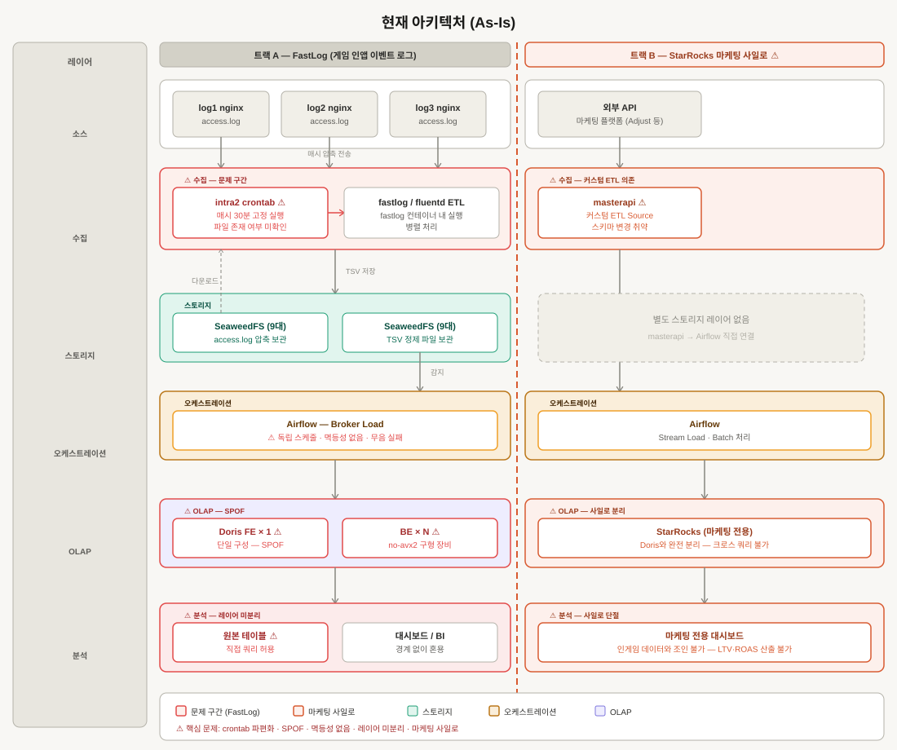
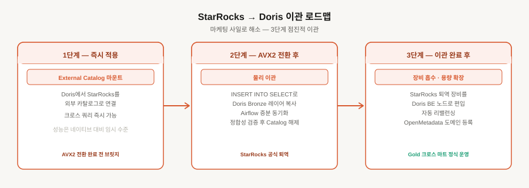

# 데이터 플랫폼 파트 — 5대 문제 & 해결 전략

> 작성일: 2026-04-10
> 대상: 데이터 플랫폼 파트 (Infra / DE / AE)

---

## 개요

데이터 플랫폼 파트가 직면한 핵심 문제 5가지와 각 문제에 대한 해결 전략을 정리한 문서입니다.
인프라 안정성 트랙(문제 1·2)과 메달리온 아키텍처 트랙(문제 3·4·5)으로 나뉘며, 두 트랙을 병행하되
문제 5의 StarRocks 통합은 AVX2 전환 안정화 이후 단계적으로 진행합니다.

---

## 현재 아키텍처 (As-Is)



**주요 문제점 요약**

| 구간 | 문제 |
|------|------|
| Doris FE | 단일 구성 — 장애 시 전체 파이프라인 중단 (SPOF) |
| BE 장비 | no-avx2 구형 장비 — 쿼리 성능 제약 |
| FastLog ETL | crontab + Airflow 이원 스케줄 — 파일 존재 여부 미확인, 무음 실패 |
| Broker Load | 멱등성 없음 — 재실행 시 중복 적재 위험 |
| 레이어 | Bronze/Silver/Gold 경계 없음 — 원본 직접 쿼리 허용 |
| StarRocks | 마케팅 데이터 사일로 — 크로스 도메인 분석 불가 |

---

## 개선 아키텍처 (To-Be)


**개선 핵심 요약**

| 구간 | 개선 내용 |
|------|-----------|
| 트랙A 레이어 순서 | 소스 → 스토리지(SeaweedFS 원본) → 수집/ETL(fluentd) → 오케스트레이션 |
| 트랙B 스토리지 | StarRocks Raw를 스토리지 행에 명시, PyAirbyte → StarRocks 흐름 명확화 |
| Doris HA | FE 3대 BDBJE HA · AVX2 롤링 전환 · SeaweedFS Filer 다중화 |
| FastLog ETL | crontab 제거 → Airflow FileSensor · DELETE→INSERT 멱등성 보장 |
| 메달리온 | Bronze(접근차단) → Silver(dbt 정제) → Gold(집계 마트) 레이어 분리 |
| Remote Tiering | Doris BE 60% 임계치 → SeaweedFS Cold Tier 자동 이관 |
| 거버넌스 | OpenMetadata Lineage · Glossary · Tier 태그 전사 적용 |
| DAG 스케줄 | FastLog DAG 매시 30분 / dbt DAG 일 1회 명시 |

---

## StarRocks → Doris 이관 로드맵



---

## 문제 1. 인프라 단일 장애점 — HA 및 AVX2 전환

### 문제 정의

Doris FE와 SeaweedFS Filer가 단일 구성으로 운영 중이어서, 장애 발생 시 전체 분석 파이프라인이
중단됩니다. 동시에 no-avx2 구형 장비의 성능 한계로 인해 쿼리 처리 속도가 제약되고 있습니다.
두 문제는 동일한 인프라 트랙의 문제로 Phase 1·2에서 순차 해결합니다.

### 해결 전략

**전략 1 — Doris FE 3대 HA 클러스터링**
BDBJE 메타데이터 복제 기반으로 리더 선출을 자동화하여 FE 1대 장애 시에도 쿼리 수신을 유지합니다.

**전략 2 — SeaweedFS Filer 다중화**
Filer 3대를 클러스터로 묶어 메타데이터 단일 실패점을 제거합니다. 볼륨 서버는 이중화 배치합니다.

**전략 3 — Ansible 롤링 AVX2 전환**
신규 AVX2 장비를 클러스터에 먼저 조인시키고 데이터가 자동 분산될 때까지 대기한 뒤, 구형 노드는
데이터가 완전히 빠진 후에만 DECOMMISSION합니다. Ansible로 노드별 avx2 도커 이미지를 1대씩
순차 교체·재시작하여 쿼리 가용성을 유지합니다.

**전략 4 — Prometheus + Alertmanager 모니터링**
전 서버에 Node Exporter·cAdvisor를 배포하고, 장애 감지 즉시 Slack on-call에 전파하는
알림 체계를 구축합니다.

### 대응 Phase

`Phase 1` `Phase 2`

---

## 문제 2. FastLog ETL 오케스트레이션 파편화 — 멱등성·원자성 부재

### 문제 정의

현재 FastLog ETL 구조는 다음과 같습니다.

```
log1·2·3 nginx 서버
  → 매시 access.log 압축 후 SeaweedFS 전송
  → intra2 서버 fastlog 컨테이너 내 fluentd가 매시 30분 crontab으로 기동
  → SeaweedFS에서 해당 시간 압축 파일 3개 다운로드 후 병렬 ETL
  → TSV 정제 후 SeaweedFS 재저장
  → Airflow가 SeaweedFS 내 fastlog 데이터를 감지 후 Doris Broker Load
```

이 구조에서 crontab(fluentd ETL)과 Airflow(Broker Load)가 분리 운영되어 서로의 완료 여부를
모르기 때문에 다음 문제가 연쇄적으로 발생합니다.

- log1·2·3 중 하나라도 SeaweedFS 전송이 늦어지면 fluentd가 파일 없는 상태에서 배치 실행 → 로그 누락
- fluentd ETL 완료 전 Airflow Broker Load 시작 가능 → 불완전 데이터 적재
- 실패 후 재실행 시 동일 데이터가 Doris에 중복 적재 → 멱등성 부재
- crontab은 실패 추적·알림 기능이 없어 ETL이 조용히 실패해도 인지 불가

### 해결 전략

**전략 1 — crontab 제거, Airflow 단일 오케스트레이션으로 통합**
intra2의 crontab을 제거하고 fluentd ETL 실행을 Airflow DAG로 완전 흡수하여
단일 오케스트레이션 체계를 만듭니다.

**전략 2 — FileSensor·Dataset 트리거로 파일 의존성 체크**
log1·2·3 압축 파일 3개가 SeaweedFS에 모두 존재하는 것을 확인한 뒤에만 ETL을 시작하도록
Airflow FileSensor 또는 Dataset 트리거를 적용합니다. 파일이 존재해야만 다음 태스크로 진행합니다.

**전략 3 — 원자적 적재 패턴으로 멱등성 보장**
Broker Load 전 대상 파티션을 DELETE 후 INSERT하는 원자적 적재 패턴을 적용해 재실행 시에도
중복 적재가 발생하지 않도록 보장합니다. 실패 시 Slack 알림과 retry + backoff 정책을 설정합니다.

### 대응 Phase

`Phase 3`

---

## 문제 3. 메타데이터 부재 — 레이어 경계와 신뢰 없음 (메달리온 뼈대)

### 문제 정의

Bronze·Silver·Gold 레이어 경계 자체가 없어 분석가가 원본과 정제 테이블을 혼용하고 있으며,
FastLog가 적재한 원본 로그가 직접 쿼리되고 있습니다. DAU·ROAS 등 핵심 지표 정의가 팀마다 달라
의사결정 신뢰성이 낮습니다.

메달리온 아키텍처 도입의 뼈대가 되는 문제로, 이 문제가 해결되지 않으면 이후 거버넌스 체계
전체가 의미를 잃습니다.

### 해결 전략

**전략 1 — OpenMetadata Tier 태그 + 오너 지정**
Bronze·Silver·Gold 각 레이어 테이블을 OpenMetadata에 등록하고, 테이블별 데이터 오너(AE)를
지정합니다. FastLog 원본 Bronze 테이블에는 `Raw / 직접 쿼리 금지` 태그를 부여하여 분석가가
정제되지 않은 데이터에 접근하는 경로를 차단합니다.

**전략 2 — 비즈니스 용어집(Glossary) 구축**
DAU·ROAS·LTV 등 전사 핵심 지표의 산출 기준을 OpenMetadata Glossary에 단일 정의합니다.
팀 간 지표 정의 충돌을 원천 차단합니다.

**전략 3 — dbt + Profiler 품질 자동화**
dbt test를 CI에 내재화하고 OpenMetadata Native Profiler로 Null·중복·이상치를 자동 감지하여
Slack 알림으로 연동합니다.

**전략 4 — End-to-End Lineage 자동 완성**
Doris·dbt·Airflow·Airbyte 커넥터를 연동하여 소스부터 Gold 마트까지 전체 데이터 흐름을
Lineage로 자동 완성합니다.

### 대응 Phase

`Phase 3` `Phase 4`

---

## 문제 4. 리소스 무통제와 스토리지 포화 — 레이어별 접근 격리 필요

### 문제 정의

Workload Group RBAC 없이 분석가 쿼리가 클러스터 전체 리소스를 점유할 수 있으며,
Bronze 원본에 대한 풀스캔이 허용되어 있습니다. 로컬 디스크가 임계치에 도달해도 자동 콜드 티어링
정책이 없어 스토리지 포화 위험이 있습니다.

메달리온 관점에서 레이어 분리는 물리적 접근 통제 없이는 유명무실하며, 거버넌스 체계와
반드시 함께 설계되어야 합니다.

### 해결 전략

**전략 1 — Doris Workload Group RBAC**
일반 사용자의 CPU·Memory 상한선과 쿼리 타임아웃을 강제 적용합니다. Bronze 직접 접근을
차단하고 Silver·Gold만 분석가에게 개방하여 메달리온 레이어 분리를 물리적으로 보장합니다.

**전략 2 — Materialized View·Rollup으로 Gold 가속**
무거운 쿼리 패턴을 분석하여 Gold 레이어에 Materialized View와 Rollup을 생성합니다.
분석가가 집계 결과를 빠르게 조회하도록 하여 클러스터 부하를 낮춥니다.

**전략 3 — SeaweedFS 콜드 티어링 자동화**
로컬 디스크 사용률 60% 도달 시 SeaweedFS로 콜드 데이터를 자동 티어링하는 정책을 적용합니다.
티어링된 테이블은 OpenMetadata에 `Tier: Cold`, `Storage: SeaweedFS` 태그로 표시하여
분석가가 조회 전 속도 지연을 사전에 인지하도록 합니다.

### 대응 Phase

`Phase 4` `Phase 6`

---

## 문제 5. 데이터 사일로 — StarRocks·Doris 이원화로 Gold 완성 불가

### 문제 정의

마케팅 데이터(StarRocks)와 인게임 로그 데이터(Doris)가 분리된 클러스터에 존재하여
LTV·ROAS 크로스 도메인 분석이 불가능하고, 메달리온 Gold 레이어의 통합 마트를 완성할 수
없습니다. AVX2 전환 완료 이후 3단계로 점진적으로 진행합니다.

### 해결 전략

**1단계 — External Catalog로 단일 DB처럼 연결 (AVX2 전환 전 즉시 적용)**

Doris에서 StarRocks 클러스터를 External Catalog로 마운트하여, 물리적으로는 두 클러스터가
분리된 상태에서도 분석가가 하나의 DB처럼 크로스 쿼리를 할 수 있도록 합니다.
이 시점부터 LTV·ROAS 크로스 도메인 분석이 가능해지고 Gold 마트 설계를 미리 시작할 수 있습니다.
단, External Catalog는 성능이 네이티브 테이블보다 느리므로 임시 조회 용도로만 사용합니다.

**2단계 — AVX2 전환 완료 후 물리 마이그레이션**

Phase 2의 AVX2 장비 전환이 완료되어 클러스터가 안정화되면, StarRocks의 마케팅 테이블을
Doris Bronze 레이어로 `INSERT INTO SELECT` 방식으로 물리 이관합니다.
Airflow DAG로 증분 동기화를 걸어두고 StarRocks와 Doris를 일정 기간 병행 운영하며
데이터 정합성을 검증합니다. 검증 완료 후 External Catalog 마운트를 해제하고
StarRocks를 공식 퇴역시킵니다.

**3단계 — 장비 추가로 점진적 용량 확장**

StarRocks 퇴역으로 확보되는 장비를 Doris 클러스터에 BE 노드로 편입하여 용량과 쿼리 병렬성을
확장합니다. 데이터가 자동 리밸런싱되면 OpenMetadata 마케팅 도메인에 이관 완료 테이블을 등록하고
Lineage에 인게임↔마케팅 조인 관계를 명시합니다. AE가 이 시점부터 Gold 크로스 마트
(LTV·ROAS 통합 대시보드)를 정식 운영합니다.

### 대응 Phase

`Phase 5`

---

## 전체 실행 우선순위

| 순위 | 문제 | 트랙 | 착수 시점 |
|------|------|------|-----------|
| 1 | 문제 1 — 인프라 HA·AVX2 | 인프라 | Phase 1·2 즉시 |
| 1 | 문제 2 — FastLog ETL 오케스트레이션 | DE | Phase 3 즉시 (병행) |
| 2 | 문제 3 — 메타데이터·메달리온 뼈대 | AE·DE | Phase 3 착수와 동시 |
| 3 | 문제 4 — 리소스 통제·티어링 | AE·DE | Phase 4 |
| 4 | 문제 5 — StarRocks 사일로 통합 | DE·AE | Phase 5 (AVX2 완료 후) |

> 문제 3은 메달리온 전체의 선행 조건이므로 Phase 3 시작과 동시에 OpenMetadata 연동을 착수해야
> 이후 문제 4·5가 의미를 가집니다.
