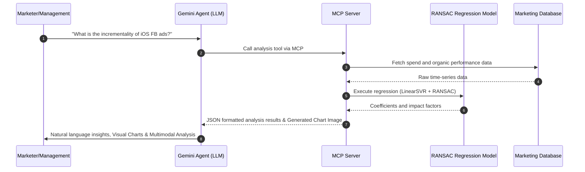

> **기간:** 2025
**역할:** AI Data Scientist & Engineer (증분 분석 모델 설계 및 에이전트 개발)
**기술 스택:** Python, Scikit-learn, Linear Regression (LinearSVR, RANSAC), MCP (Model Context Protocol), Gemini API, Marketing Mix Modeling (MMM)
> 

## 1. Background & Challenges

Apple의 **ATT(App Tracking Transparency)** 정책 도입 이후 iOS 마케팅 추적 거부 유저가 급증했습니다. 이로 인해 기존의 개별 유저 단위 **ROAS(Return on Ad Spend)** 측정이 불가능해졌고, 매출 비중이 높은 iOS 캠페인의 성과를 정확히 판단할 수 없는 '측정의 공백'이 발생했습니다. 결과적으로 iOS 마케팅 예산을 증액하거나 최적화하는 의사결정에 심각한 병목이 형성되었습니다.

## 2. Architecture: Incrementality Analysis Loop

매체 지출(Spend)과 유기적(Organic) 유입 간의 상관관계를 분석하는 모델을 구축하고, 이를 LLM 에이전트와 결합하여 경영진이 즉각적인 인사이트를 얻을 수 있도록 설계했습니다.

## 3. Solution & Technical Insights

1. **선형회귀 기반 증분 분석 모델(Incrementality Model) 구축**
    - **[Issue]** 유저 단위의 추적이 불가능한 상황에서 매체별 기여도를 거시적으로 파악해야 했습니다.
    - **[Solution]** 매체별 지출액(Spend)의 변화가 Organic 설치 및 매출의 증분(Incrementality)에 미치는 상관관계를 분석하는 **MMM(Marketing Mix Modeling) 유사 모델**을 개발했습니다. **Scikit-learn**의 선형회귀 모델과 **RANSAC** 알고리즘을 활용하여 이상치(Outlier)의 영향을 최소화하면서 각 매체의 'Organic 견인력'을 수치화했습니다.
2. **iOS 프라이버시 제약 하의 성과 측정 공백 해소**
    - **[Issue]** 개별 유저 데이터 없이도 iOS 캠페인의 실제 효율을 증명해야 했습니다.
    - **[Solution]** 특정 매체의 광고 집행 여부와 전체 매출/설치 수의 변동성을 통계적으로 분석하여, 추적 거부 유저의 기여도를 역산(Proxy)하는 방식을 도입했습니다. 이를 통해 iOS 캠페인의 진정한 가치를 입증할 수 있는 객관적 지표를 마련했습니다.
3. **LLM 기반 분석 에이전트 배포**
    - **[Issue]** 복잡한 통계 분석 결과를 비전문가인 경영진과 마케터가 즉각적으로 이해하고 활용하기 어려웠습니다.
    - **[Solution]** 분석 모델을 **MCP 서버**로 래핑하고 **Gemini API**와 결합했습니다. 에이전트가 단순히 수치를 계산하는 것을 넘어, 분석 결과의 추세(Trend)를 한눈에 볼 수 있는 **시각화 차트를 직접 생성**하도록 했습니다. 또한, 생성된 **차트 이미지와 원본 데이터를 함께 해석(Multimodal Reasoning)**하여 "광고비 증감에 따른 Organic 매출의 탄력도"와 같은 핵심 인사이트를 도출하고 실행 가능한 예산 최적화 전략을 제안하도록 구현했습니다.

## 4. Impact & Result

- 🚀 **의사결정 병목 해소:** ATT 정책 이후 불투명했던 iOS 마케팅 성과를 거시적 관점에서 가시화하여 경영진의 즉각적인 예산 결정을 지원했습니다.
- 🦾 **분석 전문성 민주화:** 복잡한 통계 모델링 결과를 자연어로 제공함으로써 마케터들이 데이터 기반의 인사이트를 스스로 도출할 수 있는 환경을 조성했습니다.
- 💰 **예산 최적화:** 증분 효율이 높은 매체에 예산을 집중하고 효율이 낮은 매체를 식별하여 마케팅 ROI를 극대화하는 데 기여했습니다.
- 🎯 **Privacy-Safe Measurement:** 개인정보를 침해하지 않는 통계적 기법을 통해 지속 가능한 마케팅 측정 체계를 선제적으로 구축했습니다.
