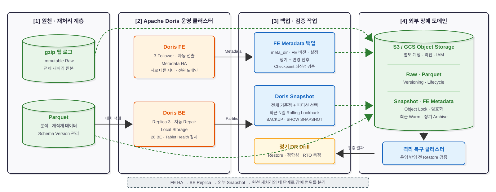

> **기간:**
> **참여인원:**
> **역할:**
> **기술 스택:** Apache Doris, SeaweedFS, S3/GCS Object Storage, Airflow

> [!note] 문서 상태
> 적용 전 운영 설계입니다. 백업 주기와 보존 기간은 아래 복구 훈련에서 측정한 RPO·RTO와 실제 저장 비용을 기준으로 확정합니다.

관련 프로젝트: [[../40대 레거시 클러스터로 구축한 Doris 기반 데이터 플랫폼|40대 레거시 클러스터로 구축한 Doris 기반 데이터 플랫폼]]

## 1. Background & Challenges

현재 Apache Doris는 **FE 3대, BE 28대의 Storage/Compute Coupled 구조**로 운영합니다. BE Replica와 FE 다중화는 단일 노드 장애를 흡수하지만, 운영 실수로 인한 삭제, 논리적 데이터 손상, FE Metadata 전체 손실, IDC 단위 장애까지 복구하는 독립 백업은 아닙니다.

- **내부 복제와 백업의 역할 차이:** 잘못된 삭제나 손상도 Replica에 전파되므로 클러스터 외부의 시점 복구본이 필요합니다.
- **Doris 데이터와 FE Metadata의 역할 차이:** BE 데이터 Snapshot은 테이블·파티션을 복원하고, FE Metadata는 카탈로그·권한·노드 정보 등 제어 영역을 복구합니다. 둘 중 하나만으로 전체 클러스터를 복구할 수 없습니다.
- **원천 데이터의 최종 안전망:** 웹 로그와 Parquet를 재처리 가능한 형태로 장기 보관하면 Snapshot이 없거나 호환되지 않는 최악의 상황에도 Doris를 다시 구축할 수 있습니다.
- **장애 도메인 분리:** 같은 IDC의 SeaweedFS는 빠른 1차 백업에는 유용하지만 IDC 장애에는 함께 영향을 받습니다. 재해 복구본은 별도 계정·리전의 S3 또는 GCS 같은 외부 객체 스토리지에 둬야 합니다.

따라서 목표는 특정 백업 제품 하나를 선택하는 것이 아니라, **FE 고가용성 → BE Replica → 외부 Snapshot → 원천 데이터 재처리**가 서로 다른 실패를 방어하도록 복구 경로를 계층화하는 것입니다.

## 2. Architecture: As-Is vs To-Be

### As-Is Architecture


1. FE 3대가 Metadata를 복제하고 BE 28대가 운영 데이터를 Replica로 유지합니다.
2. 단일 FE·BE 장애는 클러스터 내부에서 대응할 수 있지만, 논리적 손상과 다중 노드·IDC 장애를 복구할 외부 시점 복구본은 없습니다.
3. 백업 성공 여부와 실제 복원 시간을 검증하는 정기 복구 훈련도 정의되어 있지 않습니다.

### To-Be Architecture



1. **원천 데이터 보관:** gzip 웹 로그와 Parquet 분석 데이터를 불변 경로로 저장해 전체 재처리 경로를 유지합니다.
2. **클러스터 내부 HA:** FE는 3 Follower 구성을 기본으로 하고, 주요 테이블은 3 Replica와 장애 도메인 배치 정책으로 단일 노드·디스크 장애를 흡수합니다.
3. **Doris Snapshot:** S3 Repository를 등록하고 데이터베이스·테이블·파티션 단위 Snapshot을 생성합니다.
4. **FE Metadata 백업:** Master FE의 `meta_dir` 전체와 동일 버전의 FE 바이너리·설정 정보를 변경 전후 및 정기 주기로 보관합니다.
5. **원격 복제:** Snapshot, FE Metadata, 원천 데이터를 운영 클러스터와 다른 계정·리전의 S3/GCS로 복제하고 Versioning·Object Lock·Lifecycle을 적용합니다.
6. **복구 검증:** 격리된 임시 클러스터에서 정기적으로 Snapshot Restore와 원천 데이터 재적재를 수행해 정합성과 실제 RTO를 측정합니다.

## 3. Solution & Technical Insights

### 3.1 복구 수단을 네 계층으로 분리

| 방어 계층 | 보호 대상 | 대응 가능한 장애 | 복구 수단 |
|---|---|---|---|
| FE HA | Metadata 서비스 가용성 | Master 프로세스·단일 FE 장애 | Follower 재선출, 손실 FE 재가입 |
| BE Replica | 운영 데이터 가용성 | 단일 BE·디스크·Replica 장애 | 자동 Replica Repair, BE 교체 |
| Doris Snapshot | 시점 복구 | 오삭제, 논리적 손상, 다중 노드 장애 | 테이블·파티션·DB 단위 `RESTORE` |
| 원천 데이터 | 최종 재생성 | Snapshot 손상·부재, 전체 클러스터 재구축 | gzip/Parquet 재처리 후 재적재 |

- **[Issue]** HA와 Backup을 같은 것으로 취급하면 논리적 손상이 즉시 복제되고, 정상 Replica가 모두 사라진 뒤에야 복구 경로가 없다는 사실을 발견하게 됩니다.
- **[Solution]** 각 계층이 다른 장애를 맡도록 역할을 분리합니다. 단일 노드 장애에는 Replica를, 시점 복구에는 Snapshot을, 클러스터 전체 유실에는 원천 데이터 재처리를 사용합니다.

### 3.2 Snapshot은 네이티브 증분이 아닌 파티션 선택 백업으로 운영

- **[Issue]** Doris는 현재 네이티브 증분 백업을 지원하지 않습니다. 신규 파티션만 백업하면 늦게 유입되거나 갱신된 과거 파티션의 변경분이 누락될 수 있습니다.
- **[Solution]** 전체 기준 Snapshot과 파티션 선택 Snapshot을 조합합니다. 시간 파티션은 최근 N일의 **rolling lookback** 범위를 다시 백업하고, 스키마 변경이나 대규모 Backfill 이후에는 새로운 전체 기준점을 만듭니다. 백업 이력에는 Snapshot Label, Timestamp, 대상 파티션, 스키마 버전, 행 수를 함께 기록합니다.

권장 운영 주기는 고정값이 아니라 데이터 등급별 RPO에서 역산합니다.

| 데이터 등급 | 백업 방식 | 초기 운영안 |
|---|---|---|
| 핵심 Gold·Serving | 전체 기준점 + 최근 파티션 재백업 | 파티션 백업을 RPO 이내에 실행, 주 1회 전체 기준점 검토 |
| 재생성 가능한 Silver | 최근 변경 파티션 중심 | 원천 재처리 시간과 Snapshot 비용을 비교해 주기 결정 |
| Raw 웹 로그·Parquet | 불변 객체 보관 | 수집 직후 원격 복제, Lifecycle로 저비용 Tier 전환 |

공식 문서 기준으로 Backup/Restore는 Storage/Compute Coupled 모드에서만 사용할 수 있고, 비동기 Materialized View와 Storage Policy 테이블은 대상에서 제외됩니다. 또한 한 데이터베이스에서 Backup 또는 Restore 작업은 동시에 하나만 실행할 수 있습니다. 자세한 제약은 [Apache Doris Backup](https://doris.apache.org/docs/3.x/admin-manual/data-admin/backup-restore/backup/)과 [Backup and Restore Overview](https://doris.apache.org/docs/3.x/admin-manual/data-admin/backup-restore/overview/)를 기준으로 관리합니다.

### 3.3 같은 IDC 백업과 재해 복구본을 분리

- **[Issue]** SeaweedFS에만 Snapshot을 저장하면 Doris 장애에는 대응할 수 있지만, 전원·네트워크·스토리지 장애가 IDC 전체로 확산될 때 백업도 함께 잃을 수 있습니다.
- **[Solution]** SeaweedFS는 빠른 복구용 1차 Repository로 사용할 수 있으나, 최종 재해 복구본은 별도 계정·리전의 S3/GCS에 둡니다. 최근 복구본은 즉시 읽을 수 있는 Tier에 유지하고, 오래된 복구본만 저비용 Archive Tier로 전환합니다. 가장 저렴한 Tier는 반출 지연과 조기 삭제 비용 때문에 목표 RTO를 만족하지 못할 수 있으므로 실제 Restore 시간과 Egress 비용으로 선택합니다.

객체 스토리지에는 다음 보호 정책을 함께 적용합니다.

- Doris 운영 계정과 분리된 최소 권한 Backup Role
- Bucket Versioning 및 가능한 경우 Object Lock/WORM
- 전송·저장 암호화와 KMS 키 복구 절차
- Snapshot, FE Metadata, Raw 데이터별 Prefix와 Lifecycle 분리
- 백업 삭제 권한과 백업 생성 권한 분리

### 3.4 FE 장애는 Metadata 복원보다 HA 복구를 우선

- **[Issue]** 단일 FE 장애마다 오래된 Metadata 백업을 복원하면 정상 Follower보다 과거 상태로 되돌아가거나 BDB JE 정합성을 훼손할 수 있습니다.
- **[Solution]** 정상 Follower가 남아 있으면 재선출과 FE 재가입을 우선합니다. 운영 환경은 Metadata 쓰기 가용성을 위해 **3 Follower**를 서로 다른 서버·전원 장애 도메인에 배치하고, 클라이언트는 Load Balancer 또는 Master 감지와 재시도 정책을 사용합니다. Doris 공식 배포 가이드도 운영 환경에 3 Follower를 권장합니다.([Cluster Planning](https://doris.apache.org/docs/3.x/install/preparation/cluster-planning/))

FE Metadata 백업은 단일 FE 장애용이 아니라 **Follower quorum 전체 손실, Metadata 논리 손상, 클러스터 전체 재구축**의 최후 수단입니다. Master FE의 `meta_dir` 전체를 정기 보관하고 다음 항목을 같은 복구 세트로 묶습니다.

- Doris 정확한 버전과 FE 바이너리 또는 이미지 Digest
- `fe.conf`, 동적 설정, 인증·권한 및 외부 Catalog 정의
- `SHOW FRONTENDS`, 최신 Checkpoint/Image·Journal 상태
- 배포 자동화, 네트워크·DNS·Load Balancer 설정

`metadata_failure_recovery`는 잘못 사용하면 비가역적 손상을 일으킬 수 있으므로 일반 Runbook에서 자동 실행하지 않습니다. 전체 FE Metadata 복구가 필요하면 격리 환경에서 동일 버전으로 먼저 검증하고, [Metadata Operations and Maintenance](https://doris.apache.org/docs/3.x/admin-manual/trouble-shooting/metadata-operation/) 및 Doris 커뮤니티 지원 절차를 따릅니다.

### 3.5 BE 장애는 Replica 건강도 확인 후 교체

- **[Issue]** BE가 일시적으로 응답하지 않는 상황에서 즉시 `DROP BACKEND`를 실행하면 복구 가능한 Replica Metadata까지 제거하고 Repair 트래픽을 급증시킬 수 있습니다.
- **[Solution]** 먼저 `SHOW BACKENDS`와 Tablet Health를 확인하고 자동 Replica Repair가 동작할 시간을 줍니다. 계획된 축소는 `DECOMMISSION`으로 데이터 이동이 끝난 뒤 제거합니다. 영구 장애는 대체 BE 용량을 먼저 확보하고 Replica가 Healthy 상태로 회복된 뒤 기존 BE를 제거합니다. `DROP`은 노드가 영구 손실되었고 다른 Replica가 정상이라는 사실을 확인한 경우에만 사용합니다.

```sql
SHOW FRONTENDS;
SHOW BACKENDS;
SHOW PROC '/cluster_health/tablet_health';
SHOW PROC '/cluster_balance/pending_tablets';
SHOW PROC '/cluster_balance/running_tablets';
```

Doris는 대부분의 Replica Repair와 Balance를 자동 수행합니다. 수동 `ADMIN REPAIR` 또는 Replica를 `bad`로 표시하는 작업은 정상 Replica와 Repair 대상 Tablet을 확인한 뒤 제한적으로 사용합니다.([Data Replica Management](https://doris.apache.org/docs/3.x/admin-manual/maint-monitor/tablet-repair-and-balance/))

## 4. 장애 유형별 Runbook

| 장애 시나리오 | 즉시 조치 | 정상 복구 경로 | 금지·주의 사항 |
|---|---|---|---|
| Master FE 프로세스 장애 | 나머지 Follower의 Master 선출과 쓰기 가능 여부 확인, 클라이언트 재연결 | 장애 FE 원인 제거 후 재가입 | 과거 `meta_dir`를 정상 클러스터에 덮어쓰지 않음 |
| 단일 FE 디스크 영구 손실 | 정상 Master·Follower와 quorum 확인 | 빈 `meta_dir`로 동일 버전 FE를 재배포하고 `--helper`로 동기화 | Metadata Recovery Mode를 자동 실행하지 않음 |
| FE quorum 전체 손실·Metadata 손상 | 쓰기 중단, 현재 디렉터리 보존, 시점과 버전 확정 | 격리 환경에서 검증된 `meta_dir` 복구 또는 새 클러스터에 Snapshot Restore | 손상 원본 위에 백업을 바로 덮어쓰지 않음 |
| 단일 BE·디스크 장애 | `Alive`, Disk State, Tablet Health, 정상 Replica 수 확인 | 자동 Repair 관찰, 필요 시 대체 BE 추가 | 원인 확인 전 즉시 `DROP BACKEND` 금지 |
| 계획된 BE 교체 | 여유 용량과 Replica 배치 확인 | `DECOMMISSION` 후 `TabletNum=0` 확인 | Repair·Balance가 서비스 네트워크를 포화시키지 않도록 속도 관리 |
| 다중 BE 손실·`UnrecoverableNum > 0` | 적재 중단 또는 격리, 손실 범위 확정 | Snapshot Restore → 누락 구간 Raw/Parquet 재적재 | 남은 정상 Replica 삭제 금지 |
| 테이블·파티션 오삭제 | Recycle Bin 보존 기간 내 복구 가능 여부 확인 | Recycle Bin → Snapshot Restore → Raw 재처리 순서 | 원본 이름에 즉시 Restore하지 말고 임시 이름으로 정합성 검증 |
| IDC 전체 장애 | 외부 객체 스토리지와 IaC 접근 권한 확인 | 새 클러스터 구성 → FE/스키마 복구 → Snapshot Restore → 미백업 구간 재적재 | 같은 IDC의 SeaweedFS만 DR로 간주하지 않음 |

## 5. Repository 및 Backup/Restore 예시

S3 호환 Repository는 실제 SeaweedFS, S3, GCS endpoint에서 POC한 뒤 확정합니다. 운영 Credential을 SQL 파일에 평문으로 저장하지 않고 Secret Manager 또는 제한된 배포 변수로 주입합니다.

```sql
CREATE REPOSITORY `doris_dr_repo`
WITH S3
ON LOCATION "s3://<backup-bucket>/doris/<cluster-id>"
PROPERTIES
(
    "s3.endpoint" = "<s3-or-gcs-endpoint>",
    "s3.region" = "<region>",
    "s3.access_key" = "<access-key>",
    "s3.secret_key" = "<secret-key>",
    "use_path_style" = "true"
);
```

```sql
BACKUP SNAPSHOT <database>.`<snapshot-label>`
TO `doris_dr_repo`
ON (<table> PARTITION (<partition-list>));

SHOW BACKUP FROM <database>;
SHOW SNAPSHOT ON `doris_dr_repo`;
```

복원은 운영 테이블에 바로 덮어쓰지 않고 격리된 데이터베이스나 다른 테이블 이름으로 먼저 검증합니다.

```sql
RESTORE SNAPSHOT <database>.`<snapshot-label>`
FROM `doris_dr_repo`
ON (`<table>` AS `<table>_restore_verify`)
PROPERTIES
(
    "backup_timestamp" = "<timestamp>"
);

SHOW RESTORE FROM <database>;
```

복원 후에는 행 수·핵심 집계·최대 이벤트 시각·샘플 Hash를 원본과 비교하고, Backup/Restore에서 보존되지 않는 `colocate_with`와 Dynamic Partition 속성을 재설정합니다. 비동기 Materialized View는 DDL로 다시 생성합니다. 상세 구문은 [Apache Doris Restore](https://doris.apache.org/docs/3.x/admin-manual/data-admin/backup-restore/restore/)를 따릅니다.

## 6. RPO·RTO와 복구 검증 계획

백업 파일의 존재가 아니라 **복원 성공 기록**을 운영 지표로 삼습니다.

| 복구 대상 | RPO를 결정하는 값 | RTO를 결정하는 값 | 검증 방법 |
|---|---|---|---|
| 단일 FE | Follower Metadata 동기화 지연 | Master 재선출·클라이언트 재연결 시간 | 분기별 Master FE 강제 종료 훈련 |
| 단일 BE | 정상 Replica 수와 마지막 Version | Replica Clone 용량·네트워크 대역폭 | 분기별 BE 격리 및 자동 Repair 측정 |
| 테이블·파티션 | 마지막 성공 Snapshot 시각 | Snapshot 크기·다운로드·Replica 생성 시간 | 월 1회 임시 이름 Restore와 정합성 검증 |
| 전체 클러스터 | 마지막 원격 Snapshot 및 Raw 복제 시각 | 서버 준비·전체 Restore·재처리 시간 | 반기 1회 격리 클러스터 DR Drill |

초기 목표는 임의의 숫자로 고정하지 않고 다음 측정값으로 확정합니다.

- `SHOW BACKUP`의 생성·업로드·완료 시각과 실패율
- `SHOW SNAPSHOT`의 최신 정상 복구 지점과 객체 스토리지 Inventory
- `SHOW RESTORE`의 Metadata 준비·다운로드·완료 소요 시간
- FE Checkpoint/Image 최신성, BDB JE Journal 증가량, FE JVM·Disk 사용량
- `UnrecoverableNum`, `ReplicaMissingNum`, Repair Queue, BE 디스크 사용률
- 전체 Raw 재처리 처리량과 BI 서비스 재개까지 걸린 시간

## 7. Expected Impact & Decision

- 🛡️ **장애 범위별 복구 경로 확보:** FE·BE 단일 장애는 HA와 Replica로, 논리 장애는 Snapshot으로, 전체 손실은 원천 데이터 재처리로 대응합니다.
- 🌍 **IDC 장애 도메인 분리:** 같은 IDC의 SeaweedFS에만 의존하지 않고 외부 S3/GCS에 검증된 복구본을 유지합니다.
- 📦 **비용과 복구 시간 균형:** 최근 복구본은 즉시 접근 가능한 Tier, 장기 보관본은 Archive Tier로 분리해 저장 비용이 목표 RTO를 훼손하지 않도록 합니다.
- 🧪 **복구 가능성의 정량화:** 정기 Restore 결과로 RPO·RTO를 측정하고 백업 주기, 보존 기간, 네트워크 대역폭을 조정합니다.

최종 권고안은 **원천 데이터 S3/GCS 장기 보관 + Doris 파티션 선택 Snapshot + 정기 전체 기준점 + FE 3 Follower HA + `meta_dir` 버전 백업 + 정기 DR Drill**입니다. SeaweedFS는 빠른 1차 Repository로 사용할 수 있지만, 원격 객체 스토리지에 복제되지 않은 상태를 재해 복구 완료로 보지 않습니다.
