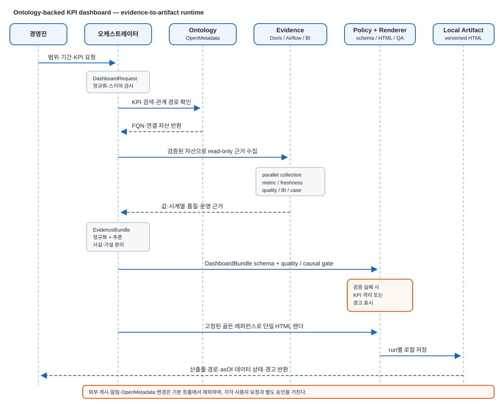

> **기간:** 2026년 9월 1차 프로토타입
> **역할:** 온톨로지·데이터 계약·에이전트 오케스트레이션 설계 및 대시보드 프로토타입 구현
> **기술 스택:** OpenMetadata, Doris, Airflow, dbt, Metabase/Superset, JSON Schema, 정적 HTML

## 1. Background & Challenges

경영진이 요구한 것은 KPI를 나열하는 현황판이 아니었습니다. 핵심 KPI가 지난 기간에 어떻게 변했는지, 그 변화는 어떤 원인과 연결되는지, 지금 잘하고 있는 부분과 개입이 필요한 부분은 어디인지, 그리고 다음 액션을 무엇으로 정할지를 짧게 브리핑받는 리포트가 필요했습니다. 즉, **Check → Act → Plan → Do(CAPD)** 순서로 읽되 그 결과가 다시 PDCA의 다음 사이클로 이어지는 경영 리듬을 화면에 담고자 했습니다.

이를 ‘건강검진 리포트’에 비유했습니다. 경영진은 한눈에 KPI의 추이와 현재 건강 상태를 확인하고, 위험 신호와 원인 후보를 살핀 뒤, 담당 조직이 취할 액션까지 이어서 판단할 수 있어야 합니다. 다만 건강 상태의 판정은 그럴듯한 설명이 아니라 지표 정의, 측정값, 신선도·품질 상태, 그리고 추론의 근거를 함께 갖춰야 합니다.

상반기에는 이 목표를 바로 구현하기보다 데이터 자산 카탈로그화와 비즈니스 용어집 구축에 집중했습니다. 아직 모든 자산과 업무 맥락이 완성된 것은 아니지만, KPI와 측정 자산을 연결할 수 있는 기본 온톨로지가 갖춰졌다고 판단했습니다. 이번 1차 프로토타입은 이 기반이 실제 경영 리포트로 작동할 수 있는지 검증하는 시도입니다.

그러나 일반적인 대시보드 생성 흐름에서는 LLM이 KPI 정의와 수치, 원인 설명, UI를 한 번에 만들어 버릴 위험이 있습니다. 이 방식은 빠르게 화면을 만들 수는 있지만, 존재하지 않는 자산 관계나 검증되지 않은 인과관계가 자연스럽게 섞일 수 있고 결과를 재현하기도 어렵습니다.

이번 1차 프로토타입의 목표는 **온톨로지를 KPI의 의미 계층으로 사용하고, 실제 측정값 및 운영 근거를 분리 수집한 뒤, 검증된 계약만으로 ‘상태 → 원인 후보 → 액션 후보’ 리포트를 생성하는 것**이었습니다. 생성형 AI는 분석과 조립을 돕되, 데이터와 화면의 최종 권위자가 되지 않도록 경계를 뒀습니다.

## 2. Solution & Architecture

핵심은 ‘질문 → 근거 → 건강 상태 → 다음 액션 → 검증 가능한 화면’의 흐름을 고정하는 것입니다. 자연어 요청은 먼저 `DashboardRequest`로 정규화합니다. 이후 OpenMetadata에서 KPI 용어 FQN, 연결 자산, 허용된 관계 경로를 확인하고, 확인된 자산에 한해서만 읽기 전용 쿼리 계획을 세웁니다.

수치·시계열은 Doris에서, 신선도와 품질 상태는 Airflow 및 테스트 메타데이터에서, 기존 의사결정 이력은 별도 근거로 수집합니다. 이 결과를 `EvidenceBundle`로 정규화한 뒤 추론과 정책 검증을 통과한 데이터만 `DashboardBundle`에 담습니다. 최종 HTML은 LLM이 직접 작성하지 않고, 고정된 골든 레퍼런스 렌더러가 계약 기반으로 생성합니다.

이 구조에서 각 계층의 책임은 다음과 같습니다.

| 계층 | 책임 | 중요한 제약 |
| --- | --- | --- |
| 요청 해석 | 범위·기간·KPI·데이터 모드를 구조화 | 요청은 스키마를 통과해야 실행 |
| 온톨로지 해석 | 용어 FQN, 자산, 관계 경로 확인 | 그래프에 없는 관계는 만들지 않음 |
| 측정·운영 근거 수집 | 값, 시계열, freshness, 품질 상태 수집 | Doris 쿼리는 읽기 전용 |
| 추론 | 이상·가설·권고 구성 | 사실·가설·결정을 분리 |
| 정책·렌더링 | 계약 검사, 화면 생성, 시각 회귀 검사 | LLM은 HTML을 직접 생성하지 않음 |
| 산출물 저장 | 실행별 HTML·요청·검증 결과 보관 | 기본 전달은 로컬 파일, 외부 게시 비활성화 |

### CAPD로 읽는 경영진 리포트

대시보드가 궁극적으로 제공해야 할 질문은 데이터 수집 순서와 다릅니다. 경영진은 다음의 CAPD 흐름으로 리포트를 읽고, 그 결과를 다음 PDCA 실행으로 연결합니다.

| 리포트 관점 | 경영진 질문 | 대시보드가 제공해야 할 근거 |
| --- | --- | --- |
| Check | KPI는 건강한가? 무엇이 얼마나 변했는가? | 현재값·추이·비교 기간·임계치·데이터 신선도 |
| Act | 어디를 먼저 대응해야 하는가? | 이상 징후, 영향 범위, 담당 도메인·조직으로 연결할 수 있는 자산 맥락 |
| Plan | 어떤 가설과 액션을 검증할 것인가? | 원인 후보, 반증·지지 근거, Candidate 권고, 기대 확인 지표 |
| Do | 누가 무엇을 실행하고 결과를 남길 것인가? | 승인된 결정, 실행 이력, 이후 Outcome 관측 |

1차 프로토타입은 Check를 위한 검증된 측정·품질 근거와 Plan을 위한 가설·권고의 안전한 표현에 우선 초점을 맞췄습니다. 부서별 책임과 실행 관리는 온톨로지에 데이터 자산의 소유·운영 맥락 및 DecisionCase가 더 축적되면서 다음 단계에서 구체화할 영역입니다.

### 온톨로지가 만드는 안전한 질의 경로

온톨로지는 단순한 용어집이 아니라, ‘이 KPI가 어떤 측정 자산으로 계산되며 어떤 품질·운영 맥락과 연결되는가’를 표현하는 탐색 경로입니다. 에이전트는 hybrid search와 제한된 BFS로 후보를 찾은 후, `measuredBy` 또는 `representedBy` 관계를 따라 실제 table·column FQN을 다시 확인합니다. 확인하지 못한 자산은 SQL 계획에서 제외합니다.

이 절차를 두면 KPI 설명문에 있는 숫자를 복사하거나 모델의 기억에 기대지 않고, 지표의 의미와 숫자의 출처를 각각 검증할 수 있습니다. 화면에는 값뿐 아니라 query hash, 관측 시점, 단위, 집계 grain 같은 provenance를 남길 수 있는 기반도 생깁니다.

### 사실·가설·결정을 섞지 않는 추론 모델

대시보드의 설명 문장이 숫자보다 더 위험할 수 있다는 점도 중요한 설계 기준이었습니다. 그래서 데이터 모델에서 다음 다섯 상태를 분리했습니다.

| 구분 | 의미 |
| --- | --- |
| Observation | DB에서 관측되고 출처가 남은 값 |
| Hypothesis | 가능한 원인을 설명하는 후보 |
| Evidence | 자산, 테스트, 파이프라인, 승인 문서 등의 근거 |
| Decision | 사람이 승인하거나 워크플로가 확정한 선택 |
| Outcome | 실행 이후 별도 기간에 관측한 결과 |

예를 들어 `supportedBy`는 가설을 지지하는 관계이지 인과 확정이 아닙니다. 승인 전 권고는 항상 Candidate로 표시하고, 그래프 근거가 없으면 추론 신뢰도를 0.6 이하로 제한합니다. 최신 테스트가 실패했거나 파이프라인이 SLA를 넘긴 경우에는 값이 있어도 정상으로 보이지 않도록 경고 상태를 올립니다.

이 구분은 AI가 반복 추론을 통해 더 유용한 보조자가 되기 위한 전제이기도 합니다. 리포트마다 나온 가설, 사람이 승인한 액션, 실행 이후의 Outcome을 같은 의미 모델 안에서 연결하면, 다음 분석은 과거의 검증된 사례를 다시 탐색할 수 있습니다. 단, AI가 스스로 가설을 사실이나 확정 인과로 승격하지는 않습니다. 축적·재사용의 단위는 언제나 근거와 승인 이력이 남은 사례여야 합니다.

### 생성 결과를 계약으로 고정하기

생성형 모델의 출력은 `DashboardBundle` JSON까지로 제한했습니다. 이 계약에는 KPI 값·임계치·시계열·세그먼트·근거·품질 정보와 관측/예측 기간을 담되, 원시 SQL 결과와 HTML 문자열은 넣지 않습니다. 렌더러는 허용된 필드만 화면에 배치합니다.

이 경계를 통해 다음 두 가지를 얻었습니다.

1. 같은 요청·데이터 워터마크·템플릿 버전이라면 결과를 재현할 수 있습니다.
2. UI 생성 과정에서 수치나 관계가 임의로 바뀌는 경로를 줄일 수 있습니다.

실행이 완료되면 요청, 검증 결과, 대시보드 HTML, manifest를 실행 ID별 폴더에 보관하고, 검증을 통과한 결과만 최신본으로 갱신합니다. 현재 프로토타입은 의도적으로 호스팅을 하지 않으며, 외부 게시·알림·OpenMetadata 변경·이슈 생성은 별도 요청과 승인 뒤에만 수행하도록 설계했습니다.

## 3. Prototype Verification

2026년 9월 10일 생성된 live-snapshot 실행에서는 OpenMetadata 용어 및 관계와 Doris의 KPI 측정 자산을 사용해 상위 5개 활성 타이틀 범위의 대시보드 산출물을 만들었습니다. 실행 manifest에는 데이터 모드, 디자인 레퍼런스 해시, 산출물 해시, 사용한 데이터 소스와 기능 버전이 함께 기록됩니다.

검증은 골든 소스 보존, JavaScript 문법, 실데이터 배지, 관측 기간 표기, 성숙 코호트 윈도우, 승인된 온톨로지 FQN 사용, 라우팅 보존, 호스팅 비활성화를 확인했습니다. 다만 이는 정적 검증 결과입니다. 브라우저 상호작용 테스트는 해당 실행 범위에 포함하지 않았습니다.

또한 예측 모델과 driver attribution 모델이 아직 연결되지 않았기 때문에, 해당 정보를 그럴듯하게 채우지 않고 `unavailable`로 표기했습니다. ARPDAU와 IAA 매출 비중은 독립적으로 승인된 용어가 확인되지 않아 Knowledge Gap으로 남겼습니다. 이처럼 빈칸과 불확실성을 숨기지 않는 것이 프로토타입의 중요한 검증 기준이었습니다.

## 4. Lessons Learned & Next Steps

이번 프로토타입에서 얻은 가장 큰 교훈은 ‘AI가 대시보드를 만든다’는 표현보다 **AI가 온톨로지 맥락과 근거를 수집해 경영진의 CAPD 판단을 보조하고, 계약과 정책이 결과를 제한한다**는 표현이 정확하다는 점입니다. 온톨로지는 답을 자동으로 보장하지 않지만, 답이 따라야 할 의미적 경로를 제공합니다. 여기에 읽기 전용 데이터 접근, 출처 모델, 정책 게이트, 결정론적 렌더러를 함께 두어야 경영 의사결정에 사용할 수 있는 수준의 신뢰성을 만들 수 있습니다.

다음 단계에서는 실제 예측 및 기여도 모델을 provenance와 함께 연결하고, KPI·자산·이상 징후를 담당 도메인과 실행 사례에 연결할 계획입니다. 브라우저 기반 상호작용·접근성·시각 회귀 검증도 자동화합니다. 그 후에도 외부 게시나 온톨로지 변경은 독립된 승인 경계를 유지해, AI의 분석 경험 축적이 데이터 거버넌스의 통제를 우회하지 않도록 발전시키려 합니다.
