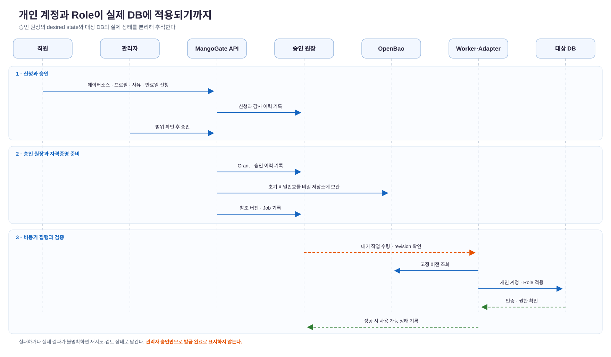

> **기간:** 2026.9 ~ 현재 운영·개선 중  
> **담당:** 데이터베이스 접근관리 체계 설계, 망고게이트 구현 및 전사 기본 계정 세팅  
> **기술 스택:** Python, FastAPI, PostgreSQL, OpenBao, React, Apache Doris, MariaDB, Docker Compose

## 1. Background & Challenges

사내 분석용 DB는 여러 부서에서 사용하지만, 오랫동안 공용 `readonly` 계정에 의존했습니다. 접근을 시작하기는 쉬웠으나 **DB 사용자명만으로 쿼리를 실행한 사람이나 조직을 구분할 수 없었습니다.** 문제가 생기면 쿼리의 책임 주체를 찾는 데 별도 조사가 필요했고, 어느 팀이 DB 자원을 얼마나 사용하는지도 계정 단위 지표로는 확인하기 어려웠습니다.

전환 전 모니터링 화면에는 `readonly`로 **약 9.93천 건의 쿼리, 1초 초과 느린 쿼리 약 3.55천 건, 스캔량 약 24.8 TiB**가 집계돼 있었습니다. 이 숫자는 첨부된 대시보드 *한 화면*의 값이며 집계 기간은 캡처에서 확인할 수 없습니다. 여러 사람의 활동이 하나의 DB 사용자명으로 합쳐진다는 문제를 보여줄 뿐, 개인별 사용량이나 전환 후 절감 효과를 뜻하지는 않습니다.

목표는 단순히 계정 발급 화면을 만드는 것이 아니었습니다. **구글 워크스페이스의 임직원 신원을 개인 DB 계정에 연결하고, 업무별 Role을 신청·승인·회수할 수 있으며, 승인 기록과 실제 DB 권한이 어긋났을 때 추적할 수 있는 체계**가 필요했습니다.

## 2. Solution & Architecture

### 신원·권한·집행을 분리

| 책임 | 망고게이트에서 맡긴 역할 |
| --- | --- |
| 신원 확인 | 임직원이 구글 워크스페이스 계정으로 로그인하고, 포털이 사용자를 식별 |
| 권한 결정 | 데이터소스별 권한 프로필을 신청하고 관리자가 목적·범위·만료일을 검토 |
| 승인 원장 | PostgreSQL에 신청, 승인, Grant, 계정 상태, 감사 이력을 기록 |
| 실제 집행 | 별도 Worker가 엔진별 Adapter를 통해 DB 계정과 Role을 적용·검증 |
| 비밀정보 | DB 비밀번호 원문은 OpenBao에 보관하고 원장에는 참조와 버전만 기록 |

사용자에게는 데이터소스의 **권한 프로필**을 신청 단위로 제공했습니다. 프로필은 DB Role과 허용 범위의 버전으로 관리합니다. 승인자는 기존 권한과 추가 효과를 확인하며, 새 프로필 버전이 만들어져도 이미 승인된 범위를 자동으로 넓히지 않습니다. 일반 임직원에게는 같은 계정 도메인에 개인 계정을 하나씩 연결해 DB 쿼리의 사용자명을 개인 단위로 분리했습니다.

승인은 DB 적용 완료와 다른 상태입니다. API가 승인 원장과 작업을 기록하면 Worker가 계정·Role 변경을 수행하고 결과를 다시 확인합니다. 그 후에야 사용 가능한 계정으로 표시합니다. 계정 발급 뒤 사용자가 포털에서 DB 비밀번호를 설정·변경하는 흐름도 같은 비밀정보 저장·비동기 적용 경로를 사용합니다.

### 설계하며 부딪힌 문제

**승인과 실제 DB 변경은 하나의 트랜잭션이 아닙니다.** PostgreSQL의 승인 기록과 Doris·MariaDB의 계정 변경을 동시에 커밋할 수 없으므로, 승인 상태를 원하는 권한 상태의 원장으로 두고 작업 큐·Worker·검증 단계로 실제 상태를 수렴시켰습니다. Worker는 계정별 작업을 직렬화하고 `desired_revision`을 확인합니다. 재시도나 중복 전달이 발생해도 오래된 작업을 최종 성공으로 확정하지 않으며, 결과가 불명확하면 수동 검토 대상으로 남깁니다.

**엔진마다 계정·Role의 문법과 확인 방식이 다릅니다.** FastAPI 서비스가 각 DB의 SQL을 직접 만들지 않도록 Adapter 경계를 두었습니다. 특히 Doris는 계정·Role과 권한 범위를 실제 조회로 확인했고, MariaDB는 `user@host`와 기본 Role 활성화 규칙을 별도로 처리했습니다. 연결 성공만으로 권한 적용 성공을 판단하지 않고, 대상 엔진에서 인증과 허용·거부 결과를 확인하는 검증 단계를 넣었습니다.

**비밀번호를 승인 원장에 넣으면 운영 편의가 보안 부채가 됩니다.** OpenBao에는 원문을 저장하고 PostgreSQL의 작업·감사 데이터에는 자격증명 참조와 고정 버전만 보관했습니다. API와 Worker의 비밀정보 접근 권한도 분리했습니다. 사용자는 최초 발급 후 포털에서 본인 확인을 거쳐 DB 전용 비밀번호를 설정·변경합니다.

## 3. Rollout & Result

전 직원의 기본 계정 세팅을 마치고, 망고게이트에서 구글 워크스페이스로 로그인해 본인 계정을 확인하고 비밀번호를 초기화하도록 안내했습니다. 계정이 보이지 않는 사람은 별도로 발급 신청을 할 수 있습니다. 공용 `readonly`는 개인 계정 전환을 안내하면서 **삭제 예정 계정**으로 공지했습니다. 삭제가 이미 끝난 것으로 기록하지 않았습니다.

- 개인 계정과 Role을 연결해, 이후 DB 사용자명 기준 관측값을 사람 단위로 구분할 수 있는 기반을 만들었습니다.
- 신청·승인·적용·회수의 상태를 분리해 관리자가 발급 지연, 실패 작업, 실제 권한과 원장의 차이를 확인할 수 있게 했습니다.
- Doris와 MariaDB 계정·Role 적용 경로를 실제 엔진에서 검증했습니다. 검증 환경과 범위는 기능마다 다르며, 모든 운영 환경의 권한·네트워크 조건을 포괄한다는 의미는 아닙니다.

전환 **이후** 개인별 쿼리 수나 자원 사용량, 장애 대응 시간의 개선율은 아직 이 글에서 제시하지 않습니다. 전환 전 대시보드 수치를 사후 성과로 재사용하지 않고, 계정별 관측 데이터가 쌓인 뒤 같은 기간·범위로 비교해야 합니다.

## 4. Lessons Learned

이번 작업에서 가장 중요했던 설계 판단은 **“승인됐다”와 “DB에서 쓸 수 있다”를 별도 상태로 다룬 것**입니다. 사용자 화면의 완료 표시를 실제 엔진 검증 뒤로 미루자 실패를 숨기지 않고 운영할 수 있었습니다. 데이터 거버넌스의 권한 정책은 문서나 포털 설정만으로 끝나지 않고, 실제 DB 권한과 계속 일치해야 한다는 점을 배웠습니다.

또한 공용 계정을 없애는 일은 계정을 일괄 생성하는 작업만으로 끝나지 않았습니다. 직원 명부와 로그인 ID 매핑, 기존 계정과의 충돌, 비밀번호 설정, 실패 계정 복구, 개인 계정 사용 안내까지 한 흐름으로 설계해야 했습니다. 앞으로는 공용 계정의 잔여 접속과 개인 계정별 쿼리 지표를 같은 관측 기준으로 추적해 전환 완료와 운영 효과를 검증하려고 합니다.
