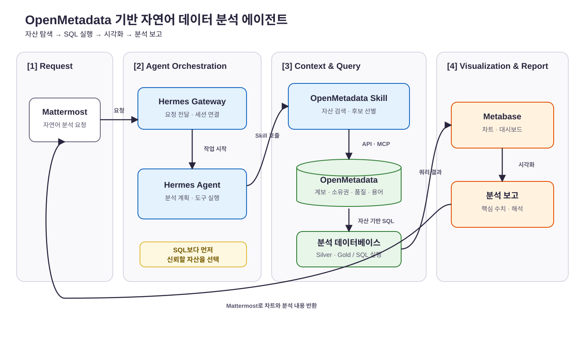

> **기간:** 2026.8
> **참여인원:**
> **역할:** 데이터 분석 에이전트 아키텍처 설계 및 OpenMetadata Skill 개발
> **기술 스택:** Mattermost, Hermes Gateway, Hermes Agent, OpenMetadata API·MCP, Agent Skills, SQL, Metabase

## 1. Background & Challenges

“이 지표를 보려면 어느 테이블을 사용해야 하나요?”, “같은 이름의 테이블 중 어떤 데이터가 맞나요?”, “분석 SQL과 대시보드를 만들어 주세요.”

이런 요청이 반복될 때마다 데이터 엔지니어는 데이터의 위치와 의미를 설명하고, 적절한 테이블을 고른 뒤 SQL과 대시보드를 직접 만들어야 했습니다. 단순한 쿼리 작성보다 **분산된 데이터 중 신뢰할 수 있는 자산을 판별하는 과정**에 많은 맥락과 시간이 필요했습니다.

기존 환경에서는 원본·정제·분석 데이터의 경계가 명확하지 않았고, 테이블 설명과 소유권, 계보가 여러 시스템에 흩어져 있었습니다. 같은 질문에도 요청을 처리하는 사람에 따라 서로 다른 테이블과 지표 정의를 선택할 위험이 있었습니다. 자연어를 곧바로 SQL로 바꾸는 것만으로는 이 문제를 해결할 수 없었습니다. SQL을 생성하기 전에 **어떤 데이터 자산이 분석 목적에 맞고 신뢰할 수 있는지 찾는 단계**가 먼저 필요했습니다.

OpenMetadata 도입과 메달리온 아키텍처 전환으로 기반을 마련했습니다. Bronze·Silver·Gold의 역할을 나누어 분석용 데이터 경로를 표준화하고, OpenMetadata에 테이블 설명, 소유권, 태그, 용어, 품질 정보와 계보를 모았습니다. 이를 바탕으로 자연어 분석 요청을 데이터 자산 탐색, SQL 실행, 시각화와 보고까지 연결하는 에이전트를 개발했습니다.

## 2. Architecture: As-Is vs To-Be

### AS-IS: 데이터 엔지니어에게 집중된 반복 분석 요청

1. 사내 직원들은 데이터 부서에 데이터 분석 요청을 전달합니다.
2. 데이터 엔지니어가 여러 데이터베이스와 파이프라인을 직접 확인해 사용할 테이블을 선택합니다.
3. 테이블의 의미와 정합성을 담당자 또는 기존 SQL을 통해 다시 검증합니다.
4. 요청별 SQL을 작성하고 실행 결과를 확인합니다.
5. Metabase 차트를 만들고 해석을 정리해 요청자에게 전달합니다.

이 구조에서는 데이터 탐색과 신뢰도 판단에 필요한 암묵지가 데이터 엔지니어에게 집중됐습니다. 비슷한 요청이 들어올 때마다 탐색부터 시각화까지 같은 작업을 반복해야 했고, 데이터 엔지니어의 응답 가능 시간이 분석의 처리량을 결정했습니다.

### TO-BE: 메타데이터 맥락을 사용하는 분석 에이전트

1. **요청 접수:** 사용자가 Mattermost에서 분석 목적, 지표, 기간과 조건을 자연어로 요청합니다.
2. **에이전트 연결:** Hermes Gateway가 요청을 Hermes Agent로 전달하고 분석 작업을 시작합니다.
3. **자산 탐색:** 별도로 제작한 OpenMetadata Skill이 API·MCP를 호출해 테이블 설명, 계보, 소유권, 태그, 용어와 품질 맥락을 검색합니다.
4. **자산 선택:** 에이전트가 요청의 분석 목적과 메달리온 레이어를 대조해 적합한 Silver·Gold 자산을 선택하고 필요한 스키마와 컬럼 정보를 확보합니다.
5. **SQL 실행:** 선택한 데이터 자산의 구조와 비즈니스 정의를 근거로 SQL을 작성해 분석 데이터베이스에서 실행합니다.
6. **시각화 및 보고:** 실행 결과를 바탕으로 Metabase 차트를 만들고, 핵심 수치와 해석을 Mattermost에 보고합니다.

## 3. Solution & Technical Insights

### 3.1 Text-to-SQL 앞에 데이터 디스커버리 배치

- **[Issue]** 자연어를 바로 SQL로 변환하면 문법적으로 올바른 쿼리를 만들 수 있어도, 오래된 테이블이나 원본 계층처럼 분석에 부적합한 자산을 선택할 수 있습니다.
- **[Solution]** 쿼리 생성 전에 OpenMetadata Skill이 데이터 자산을 검색하도록 실행 순서를 설계했습니다. 에이전트는 이름이 비슷하다는 이유만으로 테이블을 고르지 않고, 설명과 계보, 소유권, 태그, 용어, 품질 정보를 함께 확인한 뒤 분석 목적에 맞는 자산을 선택합니다.

핵심은 LLM에 스키마 전체를 전달하는 것이 아니라, OpenMetadata에 축적된 맥락을 이용해 **후보 자산을 먼저 좁히는 것**입니다. 이를 통해 데이터 탐색과 SQL 생성의 책임을 분리하고, 쿼리가 어떤 자산 정의를 근거로 작성됐는지 추적할 수 있게 했습니다.

### 3.2 메달리온 레이어를 자산 선택 기준으로 활용

- **[Issue]** 원본 데이터와 분석용 데이터가 섞여 있으면 에이전트도 사용 가능한 모든 테이블을 같은 수준의 후보로 판단하게 됩니다.
- **[Solution]** Bronze는 원천 보존, Silver는 도메인별 정제, Gold는 공통 지표와 리포트용 모델이라는 역할을 부여했습니다. 에이전트는 분석 요청에서 Silver·Gold 자산을 우선 탐색하고, OpenMetadata의 계보를 통해 해당 자산이 어떤 원천과 변환 과정을 거쳤는지 확인합니다.

메달리온 아키텍처가 데이터 자체의 역할을 표준화했다면, OpenMetadata는 그 역할과 관계를 에이전트가 검색할 수 있는 컨텍스트로 바꿉니다. 두 체계를 결합해 “조회 가능한 테이블”과 “분석에 사용해야 할 자산”을 구분했습니다.

### 3.3 OpenMetadata 연동을 Agent Skill로 모듈화

- **[Issue]** 프롬프트에 검색 절차와 API 호출 방식을 모두 넣으면 지침이 길어지고, 메타데이터 모델이나 검색 방식이 바뀔 때마다 에이전트 전체를 수정해야 합니다.
- **[Solution]** 데이터 자산 검색 절차를 OpenMetadata Skill로 분리했습니다. Skill이 자연어 요청에서 검색 조건을 만들고, OpenMetadata API·MCP를 통해 후보 자산과 관련 메타데이터를 수집해 Hermes Agent에 전달하도록 구성했습니다.

이 구조는 자연어 해석과 데이터 카탈로그 연동의 경계를 명확히 합니다. OpenMetadata 검색 로직은 Skill에서 개선하고, Hermes Agent는 분석 계획 수립과 도구 실행에 집중할 수 있습니다.

### 3.4 분석 결과를 차트와 해석까지 연결

- **[Issue]** SQL 결과만 전달하면 요청자가 다시 데이터를 해석하거나 별도의 대시보드를 만들어야 하므로 분석 요청이 끝까지 완료되지 않습니다.
- **[Solution]** SQL 실행 결과를 Metabase 차트 생성과 분석 보고 단계로 연결했습니다. 에이전트가 요청 목적에 맞는 시각화를 구성하고, 핵심 수치와 변화 양상을 자연어로 정리해 사용자가 요청을 시작한 Mattermost 채널로 반환하도록 설계했습니다.

## 4. Impact & Result

- **반복 업무의 워크플로우화:** 데이터 자산 탐색, SQL 작성·실행, Metabase 차트 생성, 결과 설명으로 이어지던 반복 작업을 하나의 에이전트 흐름으로 연결했습니다.
- **신뢰 가능한 분석 진입점 확보:** 메달리온 레이어와 OpenMetadata의 메타데이터를 함께 사용해 분석 목적에 맞는 Silver·Gold 자산을 우선 선택할 수 있게 했습니다.
- **분석 근거의 추적성 향상:** SQL 생성에 사용한 테이블의 설명과 계보, 소유권, 품질 맥락을 OpenMetadata에서 확인할 수 있어 자산 선택의 근거가 남습니다.
- **요청 채널의 일원화:** 사용자는 Mattermost에서 자연어로 요청하고 같은 채널에서 차트와 분석 내용을 받을 수 있어 별도의 데이터 도구 사용법을 익히지 않아도 됩니다.
- **데이터 엔지니어의 역할 전환:** 개별 요청마다 데이터를 찾아주는 방식에서, 신뢰할 수 있는 데이터 자산과 분석 에이전트의 탐색 규칙을 관리하는 방식으로 운영 초점을 옮겼습니다.

## 5. Lessons Learned

자연어 데이터 분석의 정확도는 SQL 생성 모델만으로 결정되지 않았습니다. 더 중요한 조건은 **분석 가능한 데이터가 표준화되어 있고, 그 의미와 계보가 기계가 검색할 수 있는 형태로 관리되는가**였습니다.

메달리온 아키텍처는 원본·정제·분석 데이터의 경계를 만들고, OpenMetadata는 각 자산의 의미와 신뢰 근거를 연결했습니다. Agent Skill은 이 컨텍스트를 실제 분석 과정에서 재사용할 수 있게 했습니다. 데이터 플랫폼의 표준화와 거버넌스가 먼저 갖춰졌기 때문에 자연어 요청을 실행 가능한 분석 작업으로 연결할 수 있었습니다.
